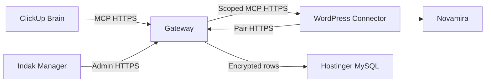

# Indak WP Gateway Threat Model

## Executive summary

The highest risks are cross-site credential compromise, pairing abuse, and SSRF through a
manager-supplied WordPress endpoint. The design limits blast radius with unique route-scoped
credentials, host-bound single-use codes, authenticated encryption, explicit endpoint
validation, and the existing default-deny execution guardrails.

## Scope and assumptions

- In scope: `src/`, the planned `src/site-manager/`, the connector plugin, MySQL registry,
  and public pairing/administration endpoints.
- Runtime is an internet-facing Hostinger Node Web App connected to Hostinger MySQL.
- Managers hold a separate `GATEWAY_ADMIN_TOKEN`; ClickUp users cannot enroll sites.
- Only WordPress administrators can configure the connector.
- Each client WordPress site is a separate trust domain; compromise of one must not cross it.
- CI provider internals, Hostinger control-plane compromise, and Novamira implementation bugs
  are out of scope, though their interfaces are modeled.

Open question for a later release: replace the shared manager token with per-person SSO so
administrative audit events identify a human rather than a token fingerprint.

## System model

### Primary components

- ClickUp calls the four MCP tools in `src/server.js`.
- The gateway authenticates callers, applies `src/guard.js`, and routes through
  `src/upstream.js`.
- The Site Manager creates pairings and manages encrypted rows through the planned repository.
- The WordPress connector pairs a site and authenticates gateway requests on one MCP route.
- Hostinger MySQL stores registry state, digests, encrypted credentials, and audit metadata.

### Data flows and trust boundaries

- ClickUp → Gateway: JSON-RPC over HTTPS; bearer-token authentication, body-size limit,
  allowlisted four-tool surface, per-site rate limiting, and guard classification.
- Manager browser → Site Manager: HTTPS administration requests authenticated separately from
  MCP use; strict schemas and endpoint normalization are required.
- WordPress connector → Pairing endpoint: HTTPS claim carrying a one-time code and site
  metadata; origin binding, expiry, attempt limits, and atomic consumption apply.
- Gateway → WordPress connector/Novamira: HTTPS JSON-RPC with one route-scoped site credential;
  upstream tools are discovered by suffix.
- Gateway → MySQL: authenticated MySQL connection; parameterized queries and a bounded pool;
  credentials are AES-256-GCM ciphertext before crossing this boundary.

#### Diagram

## Assets and security objectives

| Asset | Why it matters | Security objective |
|---|---|---|
| Per-site credentials | Permit privileged Novamira operations | C/I |
| Registry routing | Wrong routing can modify the wrong client site | I/A |
| Manager token | Can enroll, disable, and rotate sites | C/I |
| Pairing codes | Temporary authority to add one endpoint | C/I |
| Guardrail policy | Prevents dangerous live-site execution | I |
| Audit events | Required to reconstruct administrative actions | I/A |
| Gateway availability | Team-wide access depends on one endpoint | A |

## Attacker model

### Capabilities

- Send arbitrary unauthenticated HTTP requests to public gateway routes.
- Compromise or administer one client WordPress installation.
- Obtain a normal ClickUp gateway token through team-device compromise.
- Race, replay, or mutate captured application-layer requests when a token is leaked.
- Control HTTP responses from a malicious endpoint submitted during enrollment.

### Non-capabilities

- Break TLS or AES-256-GCM cryptography.
- Read Hostinger environment variables or MySQL without a separate platform compromise.
- Create pairing codes without the manager credential.
- Control another client's DNS or WordPress server by merely compromising one site.

## Entry points and attack surfaces

| Surface | How reached | Trust boundary | Notes | Evidence |
|---|---|---|---|---|
| MCP endpoint | Public POST `/mcp` | ClickUp → gateway | Token auth and four tools | `src/server.js` / `authenticate`, `TOOLS` |
| Root and health | Public GET | Internet → gateway | Must not list sites or secrets | `src/server.js` / HTTP handler |
| Upstream fetch | Tool call | Gateway → WordPress | URL and credential are security-critical | `src/upstream.js` / `Upstream._post` |
| Registry parsing | Environment/file | Operator → gateway | Current migration fallback | `src/registry.js` / `loadRegistry` |
| Pairing claim | Planned public POST | Connector → gateway | Code replay and origin binding | `docs/pairing-protocol.md` |
| Site Manager | Planned admin routes | Manager → gateway | Separate authorization required | `docs/prd.md` |
| MySQL repository | Internal runtime | Gateway → database | Parameterization and encryption required | `docs/site-registry-schema.md` |
| Connector auth hook | WordPress REST request | Gateway → connector | Must apply only to exact MCP route | `docs/pairing-protocol.md` |

## Top abuse paths

1. Attacker steals one site token, tries it against another site, and gains cross-client access.
2. Attacker steals a pairing code, races the intended site, and enrolls a malicious endpoint.
3. Manager submits an internal or metadata URL, causing the gateway to perform SSRF during
   connection validation.
4. SQL injection through a label, key, or endpoint modifies encrypted registry rows.
5. Database disclosure plus a leaked encryption key exposes every paired site credential.
6. Compromised WordPress site returns crafted MCP tool names or payloads to confuse routing.
7. ClickUp token holder invokes an unrecognized ability on live and attempts to bypass guards.
8. Attacker floods pairing or upstream validation to exhaust the database or Node worker.

## Threat model table

| Threat ID | Threat source | Prerequisites | Threat action | Impact | Impacted assets | Existing controls | Gaps | Recommended mitigations | Detection ideas | Likelihood | Impact severity | Priority |
|---|---|---|---|---|---|---|---|---|---|---|---|---|
| TM-001 | Compromised client site | One site's token or WordPress control | Reuse credential against another site | Cross-client privileged access | Site credentials, client content | Per-site routing and HTTPS (`src/upstream.js`) | Current Application Passwords are broad | Unique route-scoped tokens; bind encrypted AAD to site and endpoint | Cross-site token-fingerprint mismatch audit | Medium | High | High |
| TM-002 | Remote attacker | Temporary pairing code disclosure | Race or replay a pairing claim | Malicious site registration | Registry integrity | Planned manager-only creation | Pairing does not exist yet | Host binding, ten-minute expiry, one use, five attempts, atomic transaction | Alert on failed origin match and replay | Medium | High | High |
| TM-003 | Malicious or mistaken manager input | Valid manager token | Supply private, loopback, or redirecting endpoint | SSRF and internal service access | Host network, secrets | URL parsing currently enforces HTTPS (`src/registry.js`) | HTTPS alone does not prevent private targets | Resolve DNS; reject private/reserved IPs; recheck every redirect; cap response/time | Audit resolved IP and rejection class | Medium | High | High |
| TM-004 | Remote/admin input | Reach a database-backed route | Inject SQL through registry fields | Registry takeover or disclosure | All registry data | None yet | Repository not implemented | Parameterized queries only; strict schemas; least-privilege DB user | Database error-rate alert without raw SQL | Low | High | Medium |
| TM-005 | Database/platform attacker | Read MySQL, possibly environment separately | Decrypt fleet credentials | Fleet-wide compromise | All site credentials | Environment secrets and planned AES-GCM | Key and ciphertext coexist in one runtime | Separate key from DB; authenticated AAD; rotation version; never log plaintext | Decryption-failure and bulk-read anomaly alerts | Low | High | High |
| TM-006 | Compromised upstream | Paired site controls MCP response | Return misleading tools or oversized payloads | Confused routing or resource exhaustion | Gateway integrity/availability | Suffix discovery (`src/upstream.js`), body request limit (`src/server.js`) | Upstream response size is not bounded | Limit response bytes; require exactly one match per slot; cache verified mapping | Audit mapping changes and oversize responses | Medium | Medium | Medium |
| TM-007 | Authorized ClickUp user | Full gateway token | Invoke root/write ability on live | Client-site code execution | Live site integrity | Default-deny, writes flag, live-root block (`src/guard.js`, `src/server.js`) | Shared caller identity | Preserve refusal ordering; immutable live default; later per-person identity | Existing JSON deny audit; alert on repeated live-root attempts | Medium | High | High |
| TM-008 | Remote attacker | Public pairing/admin endpoints | Flood expensive validation/database operations | Gateway outage | Availability | Existing per-site tool limiter (`src/server.js`) | No enrollment-specific limiter yet | IP and code buckets, concurrency cap, request size limit, bounded DB pool | Rate-limit and pool-saturation metrics | Medium | Medium | Medium |

## Criticality calibration

- **Critical:** unauthenticated fleet-wide credential extraction; pre-auth arbitrary execution on
  live WordPress sites; bypass that routes one client's request to another client.
- **High:** stolen manager token enabling durable malicious enrollment; SSRF reaching sensitive
  Hostinger services; loss of encryption key together with database contents.
- **Medium:** targeted gateway outage; compromise limited to one already-compromised site;
  audit poisoning that impairs investigation without changing sites.
- **Low:** public disclosure of non-sensitive health counts; noisy invalid pairing attempts;
  sanitized diagnostics that reveal no client identity or credential.

## Focus paths for security review

| Path | Why it matters | Related Threat IDs |
|---|---|---|
| `src/server.js` | Public routing, authentication, refusal shape, and body limits | TM-007, TM-008 |
| `src/upstream.js` | Credential use, redirects, tool discovery, and response parsing | TM-001, TM-003, TM-006 |
| `src/registry.js` | Endpoint normalization and fallback precedence | TM-003, TM-007 |
| `src/guard.js` | Final live/write authorization decision | TM-007 |
| `src/site-manager/` | Planned enrollment, encryption, and database boundary | TM-002–TM-005, TM-008 |
| `wordpress/indak-gateway-connector/` | Planned scoped authentication inside WordPress | TM-001, TM-002 |
| `scripts/selftest.js` | Required regression coverage for routing and refusals | TM-001, TM-007 |

## Quality check

- Covered current and planned public entry points.
- Represented every identified trust boundary in an abuse path or threat.
- Separated runtime components from local test and migration tooling.
- Incorporated confirmed Hostinger deployment, MySQL, manager-token, and per-site-token choices.
- Recorded SSO and per-person administrative identity as deferred, not silently assumed.
